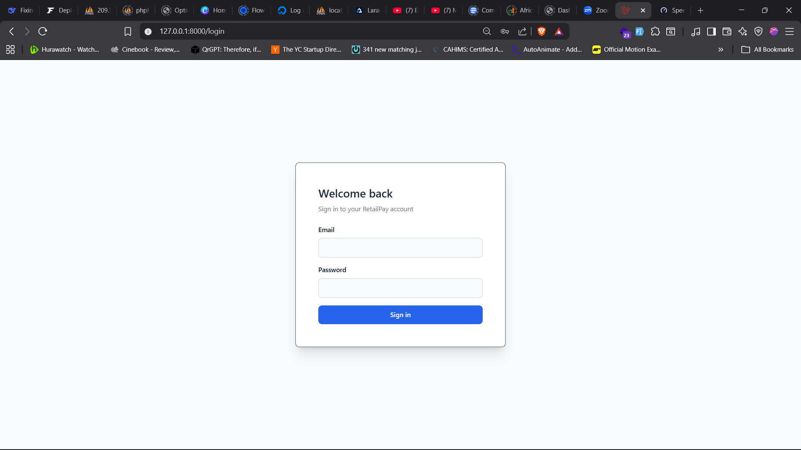
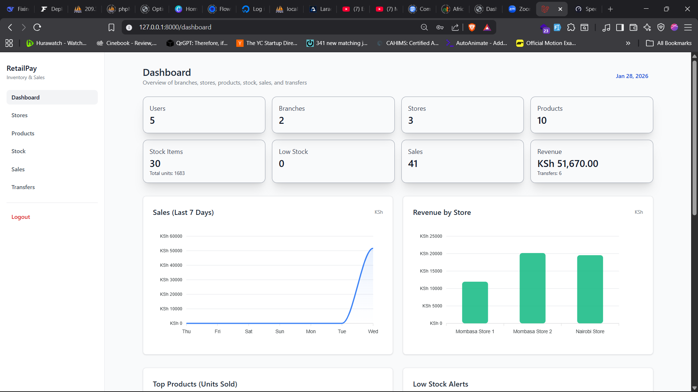
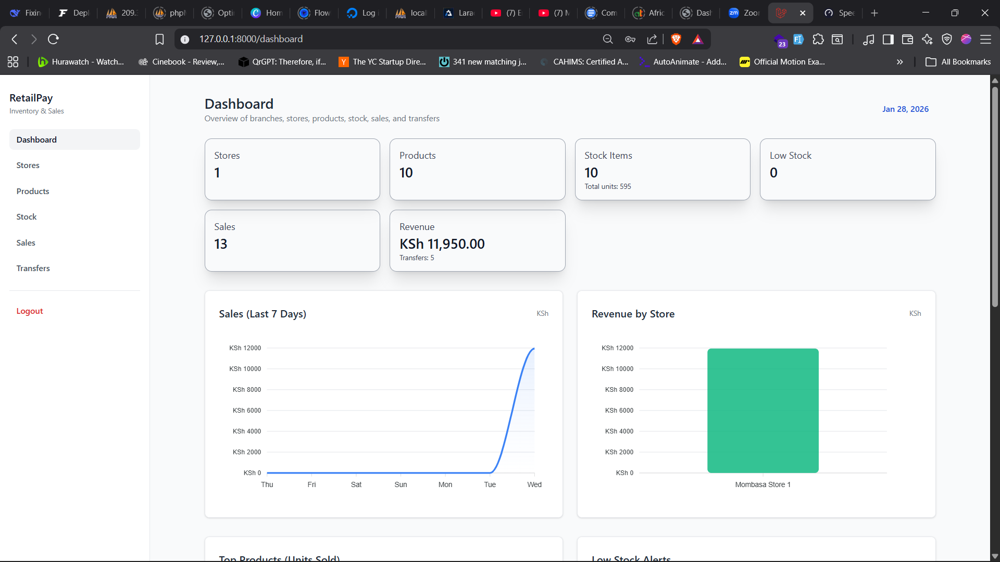
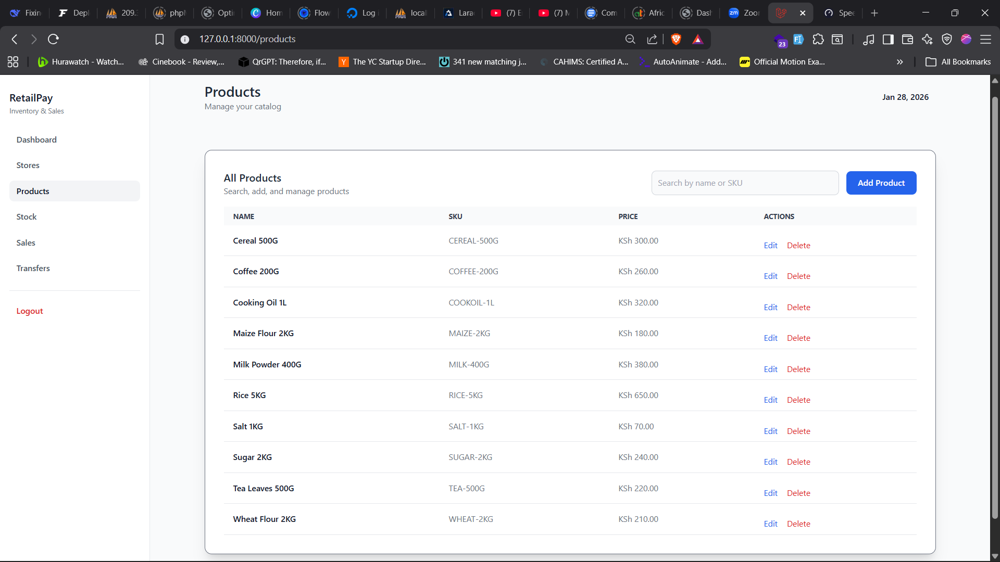
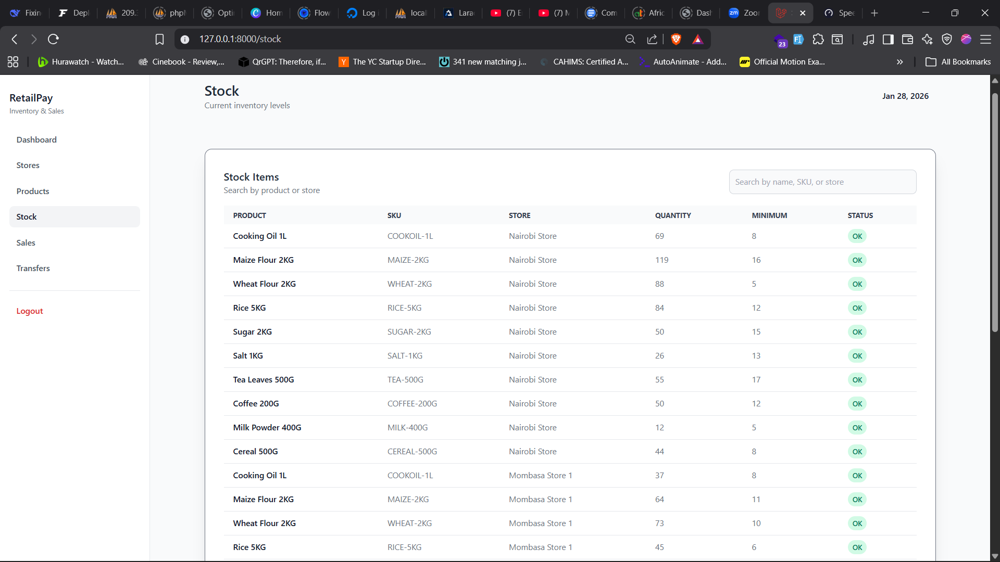
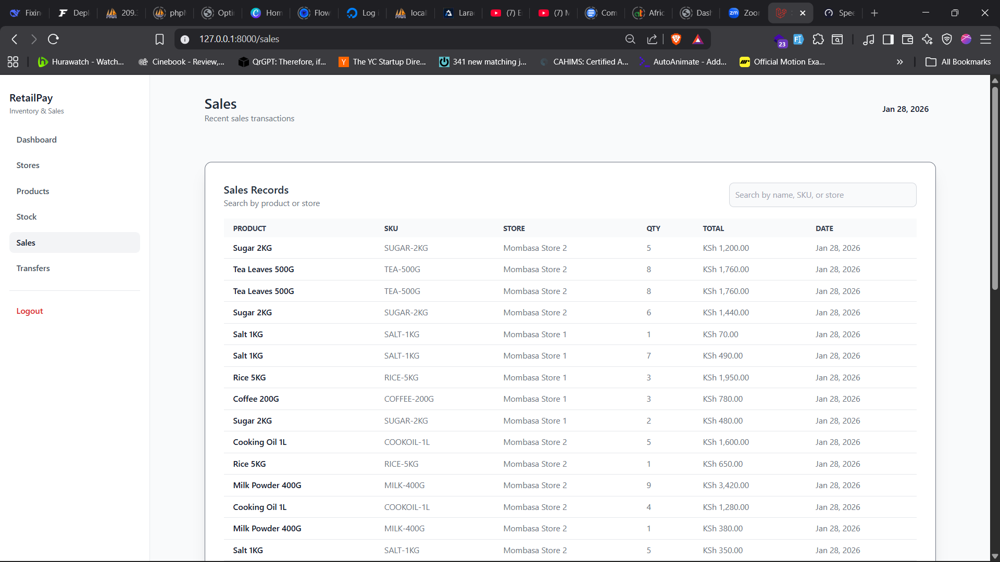
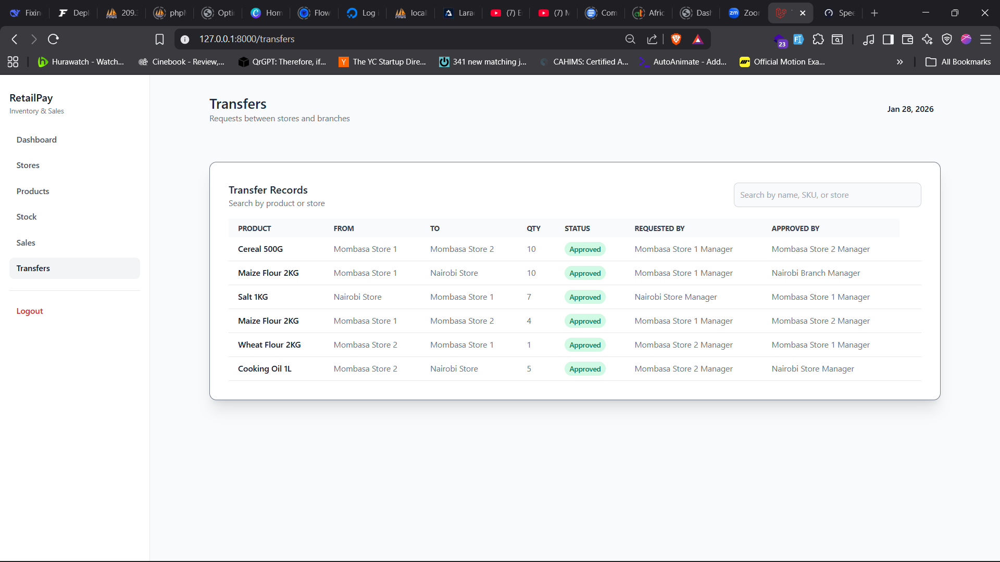

# RetailPay

RetailPay is a role-based inventory, sales, and transfer management app built with Laravel. It supports admin, branch manager, and store manager workflows with dashboards, analytics, and approval-based transfers.

## Features

- Role-based access and dashboards (admin, branch manager, store manager)
- Branches and stores overview with KPIs
- Product management (create, update, delete)
- Stock tracking with low-stock visibility
- Sales tracking and revenue summaries
- Transfer requests with approval workflow and role-based restrictions

## Screenshots

1. Login screen
	
2. Admin dashboard
	
3. Branch manager dashboard
	
4. Store manager dashboard
	
5. Products list (include create/edit modal)
	
6. Stock list (highlight low-stock rows)
	
7. Sales list
	
8. Transfers list
	

## Tech Stack

- Laravel (PHP)
- Blade templates
- Tailwind CSS + Flowbite (CDN)
- ApexCharts (dashboard charts)

## Requirements

- PHP 8.1+ with required Laravel extensions
- Composer
- MySQL/MariaDB (or compatible database)

## Installation

1. Install PHP dependencies:
	```bash
	composer install
	```

2. Create your environment file:
	```bash
	cp .env.example .env
	```

3. Generate an application key:
	```bash
	php artisan key:generate
	```

## Environment Configuration (.env)

Set the database connection to match your local setup:

```
DB_CONNECTION=mysql
DB_HOST=127.0.0.1
DB_PORT=3306
DB_DATABASE=retailpay
DB_USERNAME=your_user
DB_PASSWORD=your_password
```

If you change the app URL, also update:

```
APP_URL=http://127.0.0.1:8000
```

## Database Setup

1. Create the database (example: `retailpay`).
2. Run migrations and seeders:

```
php artisan migrate:fresh --seed
```

This will create all tables and populate sample data (branches, stores, users, products, stock, sales, transfers).

## Seeders

Seeders live in [database/seeders](database/seeders):

- `UserSeeder`: Creates demo users for each role (admin, branch manager, store manager) so dashboards and permissions can be exercised.
- `BranchSeeder`: Creates branches and links each branch to a branch manager user.
- `StoreSeeder`: Creates stores under branches and assigns store managers to stores.
- `ProductSeeder`: Seeds a catalog of products used across stock, sales, and transfers.
- `StockSeeder`: Generates stock rows per store/product with randomized quantity and minimum thresholds for low-stock examples.
- `SalesSeeder`: Creates sales records and reduces stock quantities to keep inventory consistent with sales.
- `TransferSeeder`: Creates transfer records between stores, assigns requester/approver, and updates stock to reflect approved transfers.

To re-run all seeders:
```
php artisan migrate:fresh --seed
```

## Running the App

Start the backend:
```
php artisan serve
```

Open the app at http://127.0.0.1:8000

## Roles & Access

- **Admin**: Full access to all data across branches and stores.
- **Branch Manager**: Access limited to their branch and its stores.
- **Store Manager**: Access limited to their managed stores. Transfers are restricted to the same branch.

## Default Logins (Seeded)

All seeded users share the password: **password**

- **Admin**: admin@kkwholesalers.com
- **Branch Manager (Nairobi)**: nairobimanager@kkwholesalers.com
- **Branch Manager (Mombasa)**: mombasamanager@kkwholesalers.com
- **Store Manager (Nairobi)**: nairobistore@kkwholesalers.com
- **Store Manager (Mombasa Store 1)**: mombasastore1@kkwholesalers.com
- **Store Manager (Mombasa Store 2)**: mombasastore2@kkwholesalers.com

## Assumptions & Decisions

- Admin users can view every transfer in the system.
- Branch managers can view all inter-branch activity, which also covers inter-store transfers.
- Branch managers can initiate both inter-branch and inter-store transfers.
- A branch manager cannot approve a transfer they initiated; approval must come from the manager on the receiving side.
- The same approval/visibility rules apply to store managers.
- Store managers can only initiate transfers within their own branch.
- Store managers can view inter-store transfers, which may also reflect inter-branch movement (since branches transfer via stores).
- A store manager cannot approve a transfer they initiated.

## Testing

RetailPay includes feature and unit tests to validate authentication, route protection, seeders, and basic app logic. Run all tests with:

```
php artisan test
```

### Feature Tests

- **AuthTest**: Validates login, logout, and authentication errors.
	- Login page is accessible
	- User can login with valid credentials
	- Login fails with invalid credentials
	- User can logout
- **RoutesTest**: Ensures protected routes require authentication and are accessible to logged-in users.
	- Guests are redirected from all protected routes
	- Authenticated users can access all GET routes
- **SeedersTest**: Verifies that all core entities are seeded and relationships are valid.
	- Database seeder creates users, branches, stores, products, stock, sales, transfers
	- Seeded users have expected roles and logins
	- Seeded transfers reference valid entities

### Unit Test

- **ExampleTest**: Basic test to verify PHPUnit setup.
	- Asserts that true is true

Test files are located in [tests/Feature](tests/Feature) and [tests/Unit](tests/Unit).

---
## Notes

- Authentication middleware protects all application routes except login.
- Dashboards and lists are filtered server-side based on user role.
- Transfer approvals are restricted by role and exclude the requester.
